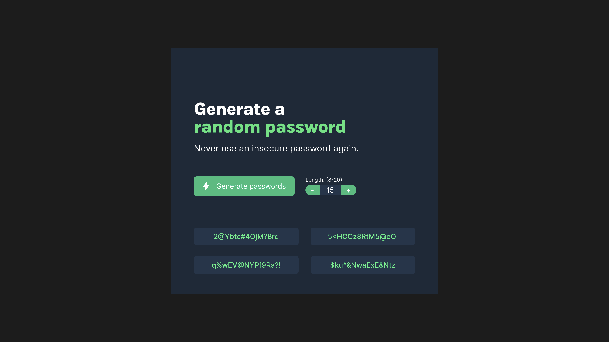
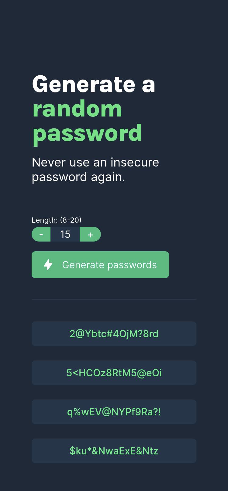

# Password Generator

A solo project from the [Scrimba Frontend Developer Career Path](https://scrimba.com/learn/frontend)

## Table of contents

- [Overview](#overview)
  - [Requirements](#requirements)
  - [Screenshots](#screenshots)
  - [Links](#links)
- [My process](#my-process)
  - [Built with](#built-with)
  - [What I learned](#what-i-learned)
  - [Useful resources](#useful-resources)
- [Author](#author)

## Overview

### Requirements

- [x] Array to hold all possible chars
- [x] Button to generate 4 random password options
- [x] Display password options
- [x] Stretch: ability to set the password length
- [x] Stretch: 1-click copy password to the clipboard

### Screenshots

### Links

- Live Site URL: [https://joshjavier.github.io/password-generator/](https://joshjavier.github.io/password-generator/)
- Scrim URL: [https://scrimba.com/scrim/cob134d689abc6025421c1d66](https://scrimba.com/scrim/cob134d689abc6025421c1d66)

## My process

### Built with

- Semantic HTML5 markup
- CSS Flexbox
- Mobile-first workflow
- Vanilla JS (async/await)

### What I learned

Initially, my passwords were using `p` tags. To achieve the second stretch goal, adding an event listener that runs the copy to clipboard function when passwords are clicked seems enough, but then keyboard users have no way of selecting the passwords (because `p` tags are not "tabbable"). So I decided to use `button` tags instead to make the passwords accessible to keyboard users.

I also refactored the "copy to clipboard" implementation in this project after finishing the [Color Scheme Generator](https://github.com/joshjavier/color-scheme-generator) which uses the same components. Basically, I learned the importance of having fallbacks (in this case, having a fallback in case `navigator.clipboard.writeText` fails when the browser doesn't have access to the clipboard).

On a related note, we might not need a fallback if in the first place we used `input` tags for the passwords and used the `document.execCommand("copy")` approach for the copy to clipboard implementation. However, using `input` is not really semantic (since we're not asking users to type in passwords) and it would just be another workaround so we can use an [already deprecated feature](https://developer.mozilla.org/en-US/docs/Web/API/Document/execCommand).

### Useful resources

- [A responsive grid layout with no media queries](https://css-tricks.com/a-responsive-grid-layout-with-no-media-queries/) - I used this as inspiration for making my password list responsive without media queries. In future projects, I look forward to exploring other approaches for [responsive layouts using fewer media queries](https://css-tricks.com/responsive-layouts-fewer-media-queries/), taking advantage of Flexbox, CSS Grid, and newer CSS features like `clamp`.

## Author

- Website - under construction
- GitHub - [@joshjavier](https://github.com/joshjavier)
- Twitter - [@joshjavierr](https://twitter.com/joshjavierr)
- LinkedIn - [@joshjavier](https://www.linkedin.com/in/joshjavier/)
